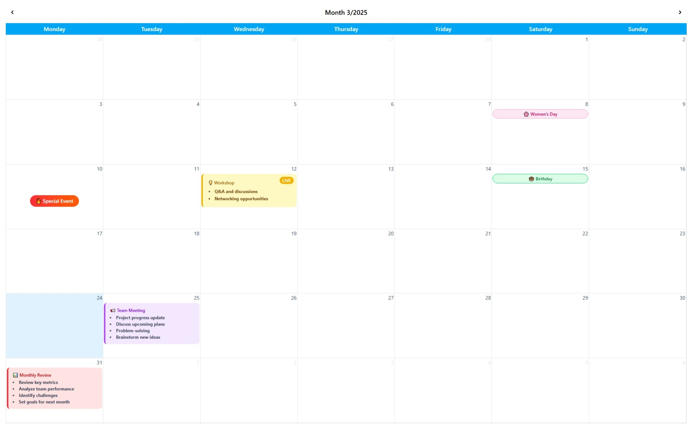

# @jofu/calendar

## Introduction

`@jofu/calendar` is a flexible React library for displaying monthly calendars



## Installation

Install the package using npm or yarn:

```sh
npm install @jofu/calendar@latest
```

or

```sh
yarn add @jofu/calendar@latest
```

## Usage

Here’s an example of how to use `JofuCalendar` in a React project:

```tsx
import React from 'react';
import JofuCalendar from '@jofu/calendar';
import '@jofu/calendar/style';

const App: React.FC = () => {
    return <JofuCalendar />;
};

export default App;
```

[See more examples](./examples/)
